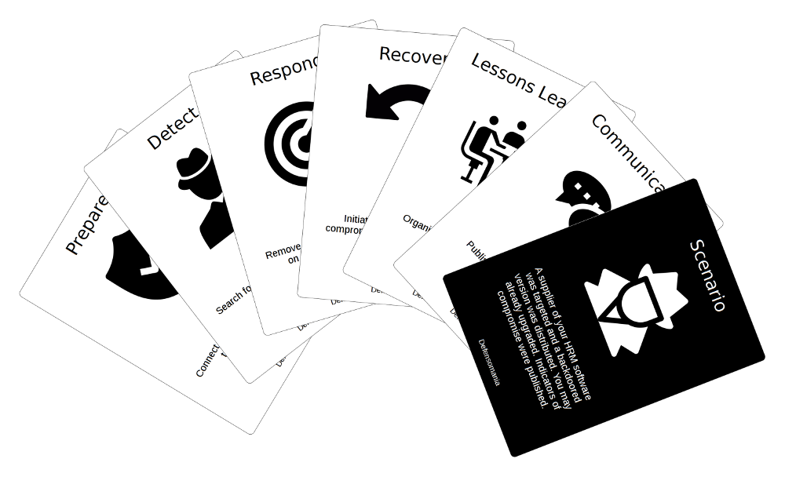
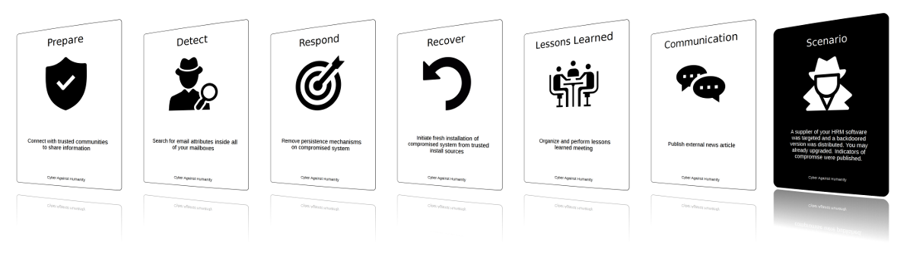
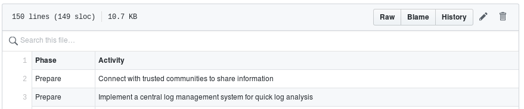

  

# Defensomania

Defensomania (formerly known as _Cyber Against Humanity_) is a card game for
security monitoring and incident response teams. When your web server is
compromised which steps would you initiate? What are your priorities if
malware was executed on an endpoint and you shortly after identify data
exfiltration to a remote server? Playing Defensomania using the provided
scenarios educates and trains defenders and provides a basis for discussing
different activities and their priorities. _How would you implement those
activities in your environment?_ Defensomania uses well-known incident phases
for the activity categories and focuses on cyber threat detection and
response.

Each round, one player is the attacker and reads a scenario card. All
others are defenders and choose their best activity card. See section
[gameplay](#gameplay) for the proposed gameplays and rules.

Defensomania is for security monitoring and incident response what
["Elevation of Privilege"
(EoP)](https://www.microsoft.com/en-us/download/details.aspx?id=20303) is for
threat modeling or
[Cornucopia](https://www.owasp.org/index.php/OWASP_Cornucopia) is for web
application security.

_**Disclaimer:** Defensomania is a personal project developed in 
the spare time and scenarios are purely fictional or related to external writeups._

## Download

See [PDFs-to-print](PDFs-to-print) for different PDFs, either including both
scenarios and activities or only one of them. Additionally, different layouts
are used: 1, 6 or 9 cards per sheet. The [PDF for all front cards using
9-cards-per-sheet without crop lines and without
bleed](https://github.com/Karneades/Defensomania/raw/master/PDFs-to-print/Defensomania-9-cards-per-sheet-all-front-without-bleed.pdf)
is suitable for home printing.

See [PNGs-to-print](PNGs-to-print) for all scenario and activity front and back
PNG image files.

1. **Print at home**. For easy printing use one of the PDFs which include
   all scenarios and activities in one PDF.
1. **Print at a local print shop or print via a commercial custom card
   manufacturer**. The required files for printing varies between shops.
   Sometimes PDFs which have 1 card per sheet are used and sometimes PNG image
   files. Mostly front and back have to be provided separately. Furthermore,
   the pre-built PDFs with 1 card per sheet and the PNG image files both
   include the conventional 1/8" bleed around the card which will be cut away
   after printing.

## Card Deck

Defensomania uses two types of cards: 
[scenarios](cards/scenarios.tsv) and [activities](cards/activities.tsv). The
scenario cards describe fictional security incidents and the activity cards
describe activities used to handle these incidents. See column _Source_ in the
[cards](cards) for external content attribution.

The activity cards are categorized based on the following well-known incident
response phases: 

* Prepare
* Detect
* Respond
* Recover
* Lessons Learned
* Communications

**See the list of [scenarios](cards/scenarios.tsv) and
[activities](cards/activities.tsv) in the source files**.

More activity cards means more possibilities during the game to react. [Consider
adding more scenarios and activities](cards).

## Gameplay

The proposed gameplays depend on your goal and what your team would
like to exercise and what the scope of the training is. Choose between the
following modes:
- Best card wins
- Incident response process

**Best card wins** lets you think about and discuss single activities and how
they fit for a given scenario.
  1. Put the scenario cards heads-down in the middle of the table.
  1. Each person draws ten activity cards (skip the _joker_ cards). The cards
     should only be visible to each player.
  1. One person in the group starts as the attacker, takes the first
     scenario card and reads it loud.
  1. Each defender proposes the best activity by passing one activity
     card, face down, to the attacker.
     _Alternatively, instead of passing the card face down each defender
     explains the proposed activity. If you want you can also include joker cards._
  1. The attacker shuffles all of the cards and shares all activities to the
     group. The attacker then picks the best activity card and whoever
     submitted it gets one defend point by getting the scenario card. Discuss
     the decision in respect to technical aspects and how you would implement
     it in your environment.
     * Prepare: What should you have had implemented to be prepared for that
       scenario?
     * Detect: How would you have been able to identify the attack? How could
         you identify current malicious activities?
     * Respond, Recover, Communication and Lessons Learned: How would you
       respond to that incident?
  1. Draw back up to 10 cards.
  1. New round begins with the next person in the group acting as attacker.

**Incident response process** is a more in-depth way of dealing
with one scenario and considers priorities and the whole incident response
process. This is serious business now. The goal is to see how the team would
handle a fictional scenario from the beginning to the end of an incident.
Discuss the processes, the responsibilities, the tools, the priorities and
also who would you contact in case of emergency. Ask questions like "if we
have that incident, what preparation is needed to be able to handle it?", "if we
must contain the compromised host how would we do that?". If you
incorporate a new subsidiary company into your security monitoring and
incident response scope, ask questions like how would you handle that scenario
for the new company and its infrastructure.
  1. Put the scenario cards heads-down in the middle of the table.
  1. Group the activity cards heads-up according to their phases.
  1. Someone in the group now takes the first scenario card, reads it out loud
     and... good luck.
  1. Now spread out the activity cards for the first incident phase _prepare_
     around the table.
  1. Each player in turn takes one card from the current phase which
     fits that scenario and describes what steps and which tools
     are used to execute it. You should discuss the activities in the group and
     its priorities for the scenario. Move forward to the next card.
  1. After all relevant cards from a phase are played move on to the next phase.

## Contributing

Consider adding [scenarios and activities](cards), improve wording and rule
descriptions or improve the layout and design.

## Build your own Defensomania

Build your own Defensomania card deck using [Squib](https://github.com/andymeneely/squib) and the [instructions](BUILD.md).

## Ideas

Further extend the card deck by adding _event_ cards to inject new events to a
otherwise static scenario. These events could be "credentials were stolen from
server X", "credentials abused on system X", "data exfiltration identified on
server X" and so on and the team can react with the activity cards to these
additional events. 

Secondly, build extra packs e.g. "Worst Response Pack". An activity for a
scenario about a compromised workstation could be "log into the machine as
domain administrator to search for malware" or "forward maldoc file to ticketing
system where different others have access too", "communicate on twitter that
you was hacked before social media department is informed". See [worst cards
](cards/worst.tsv) for some examples. Not funny enough? Then what about
building a PowerShell pack with only incident response activities using
PowerShell commands called _PowerShell Against Humanity_? Now you're scared!

## Acknowledgement & Inspiration

* Thanks to my employer [Swisscom](https://www.swisscom.ch)
 ([Github](https://github.com/swisscom)) for allowing me to publish the
 project which was inspired by my work at the
 [@swisscom_csirt](https://twitter.com/swisscom_csirt).
* Thanks to [andymeneely](https://github.com/andymeneely) for developing the
  awesome Ruby DSL [Squib](https://github.com/andymeneely/squib) for easy card
  deck building!
* Thanks to [BadThingsDaily](https://twitter.com/badthingsdaily) for tweeting
  about fictional tabletop scenarios and giving me permission to use them. They
  have the attribution in the _Source_ column in the
  [scenarios](cards/scenarios.tsv) file.
* Thanks to [droe](https://github.com/droe) for various inputs and
  improvements during game development.
* [Elevation of Privilege (EOP) by Microsoft](https://web.archive.org/web/20150312215303/http://www.microsoft.com/security/sdl/adopt/eop.aspx) ([Card Deck](https://www.microsoft.com/en-us/download/details.aspx?id=20303)): EoP is based on Microsoft's threat modeling framework "STRIDE" (Spoofing, Tampering, ...).
* [Cornucopia](https://www.owasp.org/index.php/OWASP_Cornucopia) ([Card Deck](https://www.owasp.org/images/7/71/Owasp-cornucopia-ecommerce_website.pdf)): Cornucopia is based on OWASP's Top 10 (authentication, data Validation, ...).

## Artwork

Icons made by Freepik, srip, Gregor Cresnar and Kiranshastry from www.flaticon.com.

## License

The content of this project itself is licensed under a 
[Creative Commons Attribution-ShareAlike 4.0 International (CC BY-SA 4.0)
License](https://creativecommons.org/licenses/by-sa/4.0/), and the
underlying source code used to format and display that content is licensed
under the [MIT
license](https://github.com/github/choosealicense.com/blob/gh-pages/LICENSE.md).

Defensomania is free to use. It is licensed under the Creative
Commons Attribution-ShareAlike 4.0 license, so you can copy,
distribute and transmit the work, and you can adapt it, and use it
commercially, but all provided that you attribute the work and if you alter,
transform, or build upon this work, you may distribute the resulting work only
under the same or similar license to this one.
